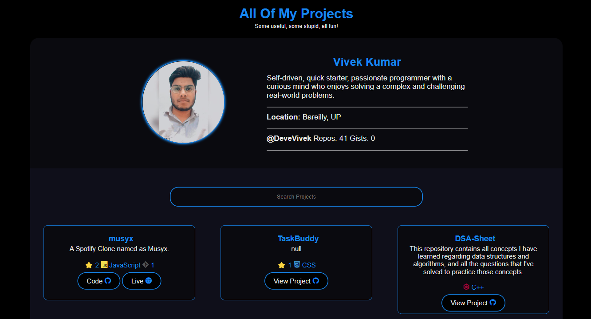

<h1><a href="https://DeveVivek.github.io/projects">Projects</a></h1>

<h3>Showcase All Your Projects 🛍️🎇</h3>

<figure>
  
   
  <figcaption>projects screenshot</figcaption>
</figure>

## Introducing Projects

Present all your projects in style with a super customizable web app! ✨

`Projects` uses the GitHub API to list all your GitHub projects in a nice searchable grid.
Also shows pretty programming icons using `devicons`.

## How it was built

Projects was built using `HTML` `CSS` & `JavaScript`.
It was built on Neovim and the python http server.
Uses GitHub API for data and Devicons for programming icons.

## What I learned

- Learned about a few quirks of the fetch API, especially implementation of `maxPages`.
- Flex, box-shadow and some other CSS tricks were revisited.

## What's next

You tell me!

Hit the ⭐ button if you found this awesome.

## More Info

<a href="https://github.com/DeveVivek/projects">Source</a> | <a href="https://DeveVivek.github.io/projects">Website</a>

